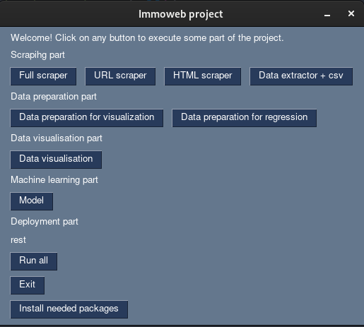

# Real estate price prediction (Global README.md)

## Project descritpion

This project is part of the data science training from Becode.org.

It aims to predict prices for houses or appartment considering the current state of the market.

It includes: web scraping, data cleaning, data visualisation,  machine learning, data engineering and a GUI.

Try the app here
https://real-estate-price-prediction-a5zb.onrender.com

## Current state

* [X] data acquisition from immoweb
* [X] data acquisition from statbel
* [X] data preparation for visualization
* [X] data preparation for modelisation
* [X] data visualization
* [X] modeling
* [X] results analysis
* [X] deployment
* [X] Memory optimized deployment for render.com
* [X] Performance optimized deployment for production
* [X] User Interface for the whole project
* [X] Apache airflow scheduling for scraping
* [ ] Make a database of the logs of users
* [ ] Compiled version of the depolyment

## What it does (In order)

this project creates a dataset from immoweb (be-fr) in the form of a csv file of this shape

| URLS (name of the column not present in the csv) |
| ------------------------------------------------ |
| url 1                                            |
| url 2                                            |
| ...                                              |
| url i                                            |
| ...                                              |
| url n-1                                          |
| url n                                            |

### Scrape all href from immoweb

1. Generates somes url to scrape ne announce
2. Scrap the urls and get the hrefs in each pages
3. Clean the hrefs by excluding all urls that are not starting by https://www.immoweb.be/fr/annonce/
4. Store the freshly obtained urls into a csv file

### Scrape all the webcontent corresponding to the previously found urls

1. Open and read the csv file of the first part
2. Get all the urls in the file
3. Scrap all the webcontent of each webpage attached to the url
4. Save each webcontent into a large ammount of html files

### Exctract the data from the previously found webcontent

1. Open and read each html file
2. Exctrat the data with bs4 and transform the data into usable types (int,bool etc.)
3. Make a dictionary with this structure:

   Dictionnary:

   * id : Inner dictionnary

   Inner dictionnary:

   * To rent : bool
   * To sell : bool
   * Price : int
   * Number of rooms : int
   * Living Area : float
   * Fully equipped kitchen : bool
   * Furnished : bool
   * Open fire : bool
   * Terrace : bool
   * Area of the terrace : float
   * Garden : bool
   * Area of the garde : float
   * Surface of the land : float
   * Surface area of the plot of land : float
   * Number of facades : int
   * Swimming pool : bool
   * State of the building : str
   * zipcode : int
   * type : str

### Saving the data in a csv file

1. Store the previous dictionary as a csv file of the shape below
2. Print the average rent, the average price and a multiplicator in months to have the value of the house

| ID     | To rent | To sell | Price  | Number of rooms | ... | zipcode | type        |
| ------ | ------- | ------- | ------ | --------------- | --- | ------- | ----------- |
| id 1   | False   | True    | 97000  | 3               | ... | 4000    | Appartement |
| id 2   | True    | False   | 800000 | None            | ... | 1825    | Penthouse   |
| ...    | ...     | ...     | ...    | ...             | ... | ...     | ...         |
| id i   | None    | None    | None   | None            | ... | None    | None        |
| ...    | ...     | ...     | ...    | ...             | ... | ...     | ...         |
| id n-1 | None    | None    | 54000  | 5               | ... | 1000    | Maison      |
| id n   | True    | False   | 1000   | 85              | ... | 1010    | Bugalow     |

### Combine other dataset to the previous one and Cleaning the data

1. get new data from external sources xlsx and csv
2. Combine different data set to add features
3. clean the data by removing outliers and droping NaN and None
4. Create new features and remove others
5. Remove features that we don't need for the data visualization and create a new csv with the processed data of this form

| ID     | To sell | Price  | Number of rooms | ... | A-Taxe | Price by M**2 | Appartment |
| ------ | ------- | ------ | --------------- | --- | ------ | ------------- | ---------- |
| id 1   | True    | 97000  | 3               | ... | 92     | 4000          | True       |
| id 2   | True    | 800000 | 2               | ... | 100    | 2132          | False      |
| ...    | ...     | ...    | ...             | ... | ...    | ...           |            |
| id i   | False   | 555    | 1               | ... | 97.2   | 12.3          | False      |
| ...    | ...     | ...    | ...             | ... | ...    | ...           |            |
| id n-1 | True    | 54000  | 5               | ... | 93     | 1100          | True       |
| id n   | False   | 1000   | 85              | ... | 98     | 17            | True       |

### Display Graphs

Display some graphs about the distribution and some relations between features like these one

This graph represent the relation between price by square meter and the municipal taxe

This graph shows the distribution of the prices of the propreties that are to sell

This graph shows the top 10 most expensive cities in term of price per square meter

This graph shows the median of the price per square meter for each type of proprety

### Train the models

* Prepare the data
* Separate the datset into provinces - region - country
* Adapt each dataset depending on the model
* Train the models

| Model                                                       | Average Prceision in %                      |
| ----------------------------------------------------------- | ------------------------------------------- |
| DecisionTreeRegressor                                       | 77,38                                       |
| ElasticNet                                                  | 67,67                                       |
| GradientBoostingRegressor                                   | 80,47                                       |
| KNeighborsRegressor k = 10-200                         | 76,11 k=200 to 78,87 k=21                   |
| Lasso                                                       | 76,96                                       |
| LinearRegression                                            | 76,95                                       |
| RandomForestRegressor d  = 50 - 350 n = 20 - 295 | 80,28 d=350 & n=20 81,33 d=150 & n=170 |
| Ridge                                                       | 76,95                                       |
| SVR                                                         | 71,11                                       |
| XGBoost Absolute error mode                            | 69,86                                       |
| XGBoost Squared  error mode                           | 82,78                                       |

#### Results analysis

From the result that I obtained, It's obvious that there is a model that is clearly ahead in term of precision

| Province            | Model     | R2    | Mean Squared Error | Mean Absolute  Precision |
| ------------------- | --------- | ----- | ---------------------------- | ---------------------------------- |
| Belgique            | XGBoostSE | 0.601 | 1054082.709                  | 81.6%                              |
| Bruxelles-Capitale  | XGBoostSE | 0.325 | 984378.209                   | 84.0%                              |
| Region Flamande     | XGBoostSE | 0.602 | 1006036.804                  | 84.1%                              |
| Region Wallone      | XGBoostSE | 0.478 | 633641.906                   | 78.7%                              |
| Province d'Anvers   | XGBoostSE | 0.505 | 695801.057                   | 85.2%                              |
| Flandre-Occidentale | XGBoostSE | 0.632 | 1516085.148                  | 83.3%                              |
| Flandre-Orientale   | XGBoostSE | 0.607 | 836908.587                   | 85.1%                              |
| Limbourg            | XGBoostSE | 0.633 | 573336.521                   | 86.1%                              |
| Liège              | XGBoostSE | 0.398 | 538363.532                   | 79.7%                              |
| Luxembourg          | XGBoostSE | 0.547 | 625537.802                   | 81.2%                              |
| Namur               | XGBoostSE | 0.503 | 577347.691                   | 80.3%                              |
| Brabant flamand     | XGBoostSE | 0.635 | 702516.832                   | 88.3%                              |
| Brabant flamand 2   | XGBoostSE | 0.888 | 2794071.127                  | 87.4%                              |
| Brabant wallon      | XGBoostSE | 0.726 | 880901.734                   | 89.4%                              |
| Hainaut 1           | XGBoostSE | 0.506 | 291272.189                   | 81.5%                              |
| Hainaut 2           | XGBoostSE | 0.430 | 354904.131                   | 79.1%                              |

The table shows the results of the best models applied to different provinces or region in Belgium. The R-squared value, mean squared error (MSE), mean absolute error (MAE), and mean absolute precision (MAP) are shown for each province.

In general, the R-squared values of the model are moderate to high, with a range of 0.32 to 0.89. This suggests that the model is able to explain a moderate to high amount of the variability in the data. However, it should be noted that a high R-squared value does not necessarily indicate a good model, as it may be overfitting.

The MSE values are also moderate to high, ranging from 695801.05 to 2794071.12. Lower MSE values indicate that the model makes smaller errors in its predictions.

The MAP values range from 0.79 to 0.89, which indicates that the model's predictions are relatively accurate. However, it should be noted that the MAP values are not that high, which means that the model may not be accurate in all cases and that further analysis is needed.

It's worth noting that the XGBoostSE model performed better in some provinces like Province du Brabant flamand 2, Province du Brabant wallon and Province de Limbourg, with R-squared values higher than 0.8 and MAP values less than 0.85. On the other hand, provinces and regions like Bruxelles-Capitale, Province de Liège, Province de Namur, Region Wallone and Province du Hainaut 2 show lower performance.

It's also important to note that these results are based on a single training and testing set, and additional evaluation methods such as cross-validation should be performed to confirm the robustness of the model.

I also estimate that in a perfect world, we could have a maximum precision of 3777 euros due to the fact that some propreties are perfectly similar except for the price.

### Deployment

#### Web application

The web application is made using flask. It works in several steps

**Initialization**

1. Load the CSV file with the original data
2. Load the pickle files containing the machine learning models
3. Create the conversion dictionaries to adapt the data to the models
   - zipcode to median price at given
   - zipcode-zipcode to tax at given zipcode
   - proprety type to median price at given proprety type
4. Run the app

**Application**

1. Render the idle page
2. Get the user data with the form of the web interface
3. Verify the data to make sure they are plausible or even possible
4. (Render the page with errors if needed and go back to step 2)
5. Transform the data for the model
6. Get the model corresponding to the zipcode
7. Predict the price with the model
8. Save the values and result inside a log file
9. Render the page with the result (go back to step 2)

##### Visuals

###### idle (first time you get to the page)

###### requiered field not entered

###### result of the estimation

#### User interface

The project comes with a simple user interface of this form

## How to use it

You can go to https://real-estate-price-prediction-a5zb.onrender.com to try the app.

You can launch the main.py to get a simple user interface to launch the project or part of it.

You can make the docker image from the deployment part everything is ready for it

You can also launch each part of the project independently or import part of the project as a library (part of the project are already capable of working on any kind of website or data)

## Prerequises (Global)

Python 3.11.1 64-bit

Firefox

*Tested on Fedora release 37 (Thirty Seven) x86_64 kernel 6.0.15-300.fc37.x86_64 but it should works on most linux distro

* PySimpleGUI

Other requierements can be directly installed from the user interface from main.py

## Recommended system requirements

CPU: 8core (Intel i7-10875H)

RAM: 64GB (works with 32GB with no other software running)

GPU: /

Vram: /

HDD: 15GB of free space (SSD recommanded because of the large number of small files)
