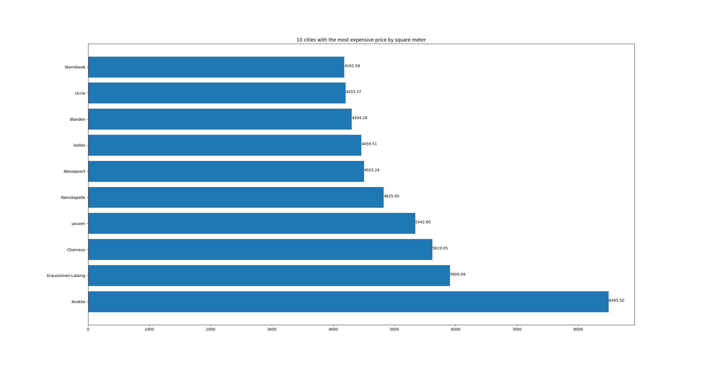
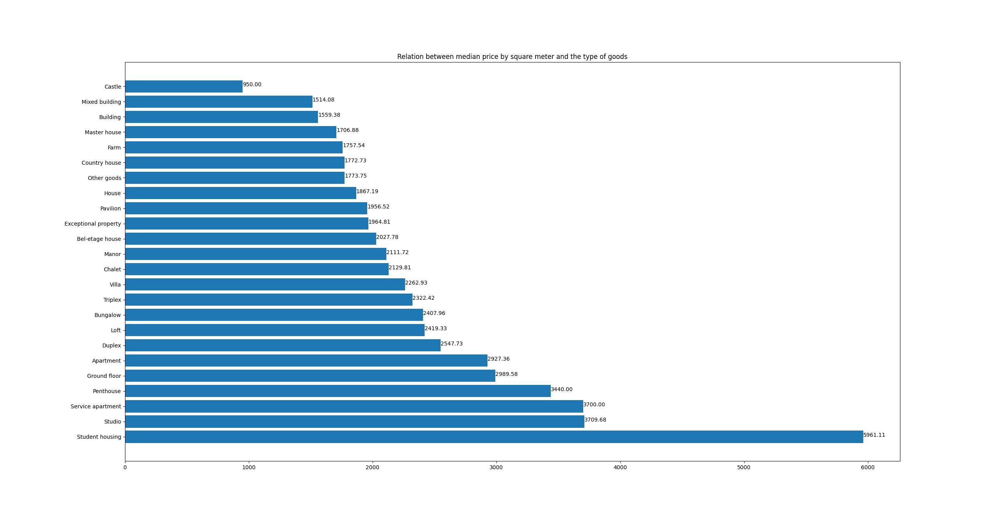

# Real estate price prediction (Data visualization README.md)

## Project descritpion

This project is part of the data science training from Becode.org.

It aims to predict prices for houses or appartment considering the current state of the market.

## Current state

* Finalized but a cleaner code is to come

## What it does (In order)

### Display Graphs

Display some graphs about the distribution and some relations between features like these one

This graph represent the relation between price by square meter and the municipal taxe

This graph shows the distribution of the prices of the propreties that are to sell

This graph shows the top 10 most expensive cities in term of price per square meter

This graph shows the median of the price per square meter for each type of proprety

## How to use it

You can launch the main.py to get a simple user interface to launch the project or part of it.

You can make the docker image from the deployment part everything is ready for it

You can also launch each part of the project independently or import part of the project as a library (part of the project are already capable of working on any kind of website or data)

## Prerequises (Global)

Python 3.11.1 64-bit

Firefox

*Tested on Fedora release 37 (Thirty Seven) x86_64 kernel 6.0.15-300.fc37.x86_64 but it should works on most linux distro

* PySimpleGUI

Other requierements can be directly installed from the user interface from main.py

## Recommended system requirements

CPU: 8core (Intel i7-10875H)

RAM: 64GB (works with 32GB with no other software running)

GPU: /

Vram: /

HDD: 15GB of free space (SSD recommanded because of the large number of small files)
