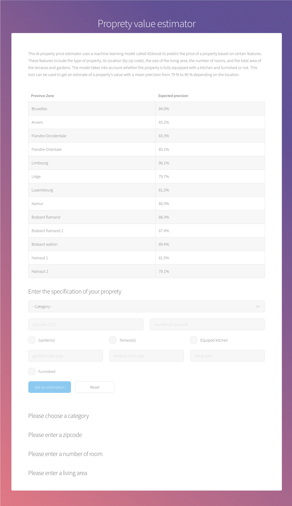
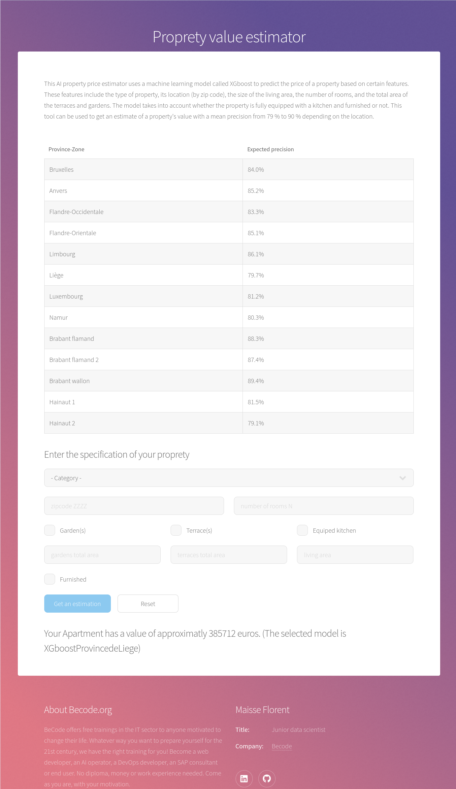

# Real estate price prediction (Deployment README.md)

## Project descritpion

This project is part of the data science training from Becode.org.

It aims to predict prices for houses or appartment considering the current state of the market.

## Current state

* Add a database to the project

## What it does (In order)

### Deployment

#### Web application

The web application is made using flask. It works in several steps

**Initialization**

1. Load the CSV file with the original data
2. Load the pickle files containing the machine learning models
3. Create the conversion dictionaries to adapt the data to the models
   - zipcode to median price at given
   - zipcode-zipcode to tax at given zipcode
   - proprety type to median price at given proprety type
4. Run the app

**Application**

1. Render the idle page
2. Get the user data with the form of the web interface
3. Verify the data to make sure they are plausible or even possible
4. (Render the page with errors if needed and go back to step 2)
5. Transform the data for the model
6. Get the model corresponding to the zipcode
7. Predict the price with the model
8. Save the values and result inside a log file
9. Render the page with the result (go back to step 2)

##### Visuals

###### idle (first time you get to the page)

###### requiered field not entered

###### result of the estimation

## Prerequises (Global)

Python 3.11.1 64-bit

Firefox

*Tested on Fedora release 37 (Thirty Seven) x86_64 kernel 6.0.15-300.fc37.x86_64 but it should works on most linux distro

* PySimpleGUI

Other requierements can be directly installed from the user interface from main.py

## Recommended system requirements

CPU: 8core (Intel i7-10875H)

RAM: 64GB (works with 32GB with no other software running)

GPU: /

Vram: /

HDD: 15GB of free space (SSD recommanded because of the large number of small files)
